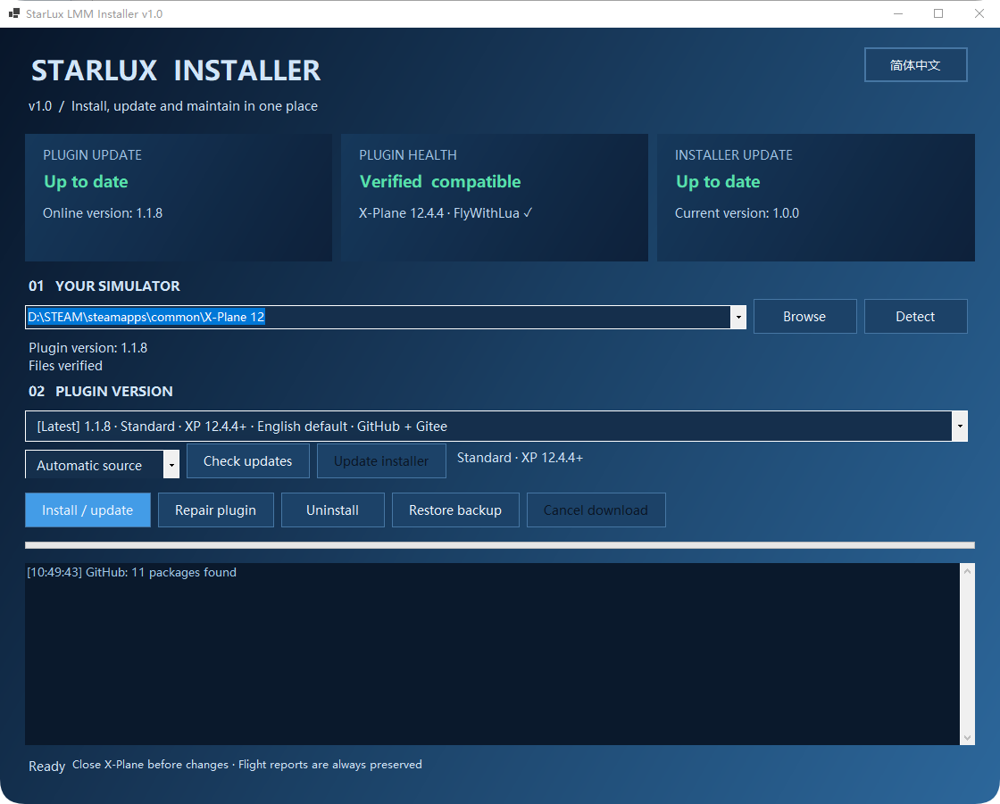
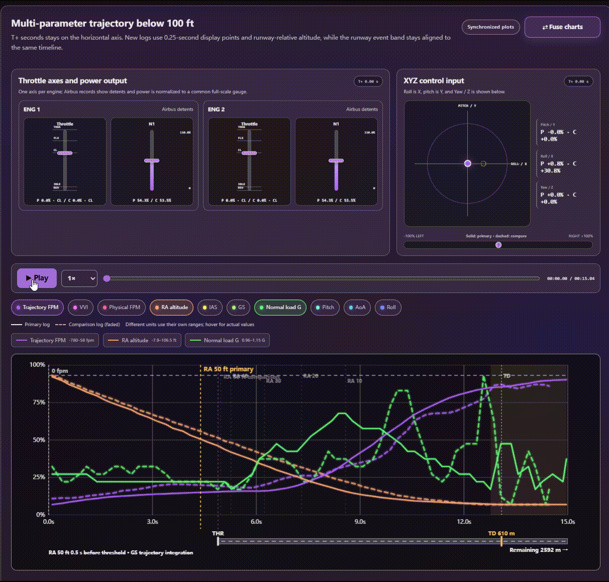
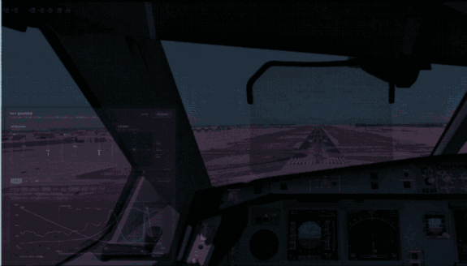

# StarLux Landing Meter

StarLux Landing Meter 是一款适用于 X-Plane 12 与 FlyWithLua NG+ 的落地分析插件。记录垂直速度、载荷、姿态、风况、拉平轨迹、操纵输入与动力输出，在游戏内给出结果，并生成可复盘、可对比、可复核的本地报告。
# 我们重视数据来源的准确性与透明度，很多情况下，模拟器是如何得到这个数据的，比数据本身更加有价值。

A local landing-analysis plugin for X-Plane 12 and FlyWithLua NG+. Review touchdown measurements, control inputs, engine output and runway position with synchronized charts and transparent source data. Flight records stay on your computer.
# We care about data accuracy and transparency. In many cases, how the simulator generates the data matters more than the actual numbers.

**[下载 1.1.8 / Download](https://github.com/Starlux531/StarLux-Landing-Meter/releases/tag/v1.1.8)** · [安装说明 / Installation guide](README_1.1.8.md) · [技术手册 1.0 / Technical manual](docs/technical-manual/README.md) · [更新记录 / Changelog](CHANGELOG.md) · [问题反馈 / Issues](https://github.com/Starlux531/StarLux-Landing-Meter/issues)

本项目持续更新，欢迎提供测试反馈与建议。赞助支持与先行测试：[爱发电 / Support development](https://afdian.com/a/StarluxLMM)。

## 安装与版本选择 / Installation

推荐下载完整离线包 `StarLux_LMM_Installer_1.1.8.zip`。解压后只有安装器和 `version` 文件夹，运行 `StarLux_LMM_installer_安装器.exe`，确认 XP 根目录与版本后安装。缺少 FlyWithLua 时，安装器会先征求下载或导入许可；旧文件备份到安装器旁的 `backup`，设置、日志和机场缓存保留。

Download the offline bundle, extract it, run the installer and confirm your X-Plane folder and edition. Existing settings/logs are preserved. FlyWithLua installation requires your consent; replaced files are backed up beside the installer.

| 版本 / Edition | 适用范围 / Compatibility | 语言 / Language |
| --- | --- | --- |
| **Standard** | X-Plane **12.4.4+**，SDK 440 原生 UI / Native UI | CN 默认中文；International 默认英文。一个全局语言选项 / One global language option |
| **Compatibility** | X-Plane 12、**12.4.4 之前** / Pre-12.4.4 | 传统英文设置／记录控件；中文报告与标准字号中文弹窗保留 / English legacy controls; Chinese reports and normal-size popup supported |

`【最新 / Latest】` 表示已读取目录中的最高版本，**不代表自动匹配 XP 兼容性**。已有配置优先于发行包默认语言。仅保留一个启用的 LMM 主脚本。兼容版不调用新的 SDK 440 字体接口；两种 UI 使用相同落地算法。

Latest means the highest version in the loaded catalog, not automatic simulator compatibility. Existing language settings take priority. Keep only one active LMM main script. Both editions retain the same landing algorithms.

只需分析报告？下载并双击 **`Starlux_Analyzer_落地分析器.html`** 即可，无需安装插件。它使用独立浏览器设置空间，不影响插件内的 `LMM_Report_Reader.html`。

For analysis only, open the standalone HTML. It requires no simulator and uses preferences isolated from the plugin's bundled analyzer.

GitHub 会去掉直接附件名称中的中文。需要保留完整名称时，请下载 `Starlux_Analyzer_1.1.8.zip` 或 `StarLux_LMM_Installer_Only_1.1.8.zip`，解压即可；完整安装包内的文件名也完整保留。直接下载入口带有双语标签，文件内容相同。

GitHub strips Chinese characters from direct asset filenames. The analyzer-only and installer-only ZIPs preserve the requested names inside, as does the complete bundle. Direct HTML/EXE downloads have bilingual labels and identical contents.

### 安装与更新界面 / Install and update

选择模拟器目录、查看插件与依赖状态，再选择要安装的版本。下图为作者提供的最新安装器界面；安装器与插件采用独立版本号，具体能力以下载版本及安装说明为准。

Choose the simulator folder, check plugin/dependency status and select a version. This author-provided screenshot shows the latest installer UI. Installer and plugin version numbers are independent; consult your downloaded build and installation guide for available features.

  

## 动态演示 / Interactive charts in motion

100 ft 轨迹、操纵输入、舵面响应和动力输出共用时间轴，鼠标指向可同步读数；支持播放、拖动进度与融合／分离视图。

Trajectory, controls, surfaces and power output share one timeline, with synchronized hover readouts, playback, scrubbing and fused/separated views.

  

英文分析器播放演示，原始 GIF 约 0.94 MB。 / English analyzer playback; original GIF approximately 0.94 MB.

### 模拟器内的落地过程 / Touchdown in the simulator

从驾驶舱内观察落地过程与 LMM 的显示。主页使用约 2.77 MB 的压缩预览；点击可查看约 24.60 MB 的原始 GIF，原始时长保留。

Watch the touchdown and LMM display from the cockpit. The page uses a roughly 2.77 MB preview; click for the approximately 24.60 MB original GIF. The full duration is retained.

  

## 报告总览 / Landing report overview

接地读数、评分来源、相对风、姿态、真实跑道位置与操作曲线集中复盘。网页颜色由 RGB 自动生成，也可保存缩放、布局与曲线选择。

Review touchdown values, rating sources, wind, attitude, runway geometry and control traces together. RGB themes and saved presets include zoom, layout and selected curves.

  

## 游戏内设置与记录 / In-simulator settings and records

两个独立菜单入口；设置按通用、位置、配色、字体、工具分区，记录窗口区分打开、删除确认与翻页。下面是标准版的作者实机截图，设置图左侧为预览弹窗，不是一次有效落地结果。

Separate Settings and Landing records menus, grouped settings, visible slider handles and confirmed deletion. These are author-provided standard-edition screenshots; the popup in the Settings screenshot is a preview, not a recorded landing.

<table>
  <tr><th width="55%">设置与弹窗预览 / Settings &amp; popup preview</th><th width="45%">落地记录 / Landing records</th></tr>
  <tr>
    <td valign="top"></td>
    <td valign="top"></td>
  </tr>
</table>
  
## 完整图集：配色、英文界面和原始数据 / Full gallery: themes, English UI and raw data

### 完整复盘页面 / Complete dashboards

长截图并排展示不同配色和语言，点击可查看原分辨率。英文界面可加载中文历史报告，原始 TXT 保持原文。

Click either full-page screenshot for original resolution. English UI can load historical Chinese reports; the raw TXT remains unchanged.

<table>
  <tr><th width="50%">青色主题 / Cyan theme</th><th width="50%">英文紫色主题 / English violet theme</th></tr>
  <tr>
    <td valign="top"></td>
    <td valign="top"></td>
  </tr>
</table>

### 可核对的原始记录 / Inspectable source records

保留 TXT 聚合轨迹表，方便核对每个时间点的数据，不改写原始记录。

The original aggregated TXT trace remains available for checking recorded samples.

  

## 当前能力 / Features

- **接地过程**：记录首次接地后的持续过程与弹跳；无弹跳时继续记录约两秒。FPM 保留物理、VVI、AGL 的来源复核，G 保留固定 160 ms 稳健值与冲量闭合复核。
- **操纵与动力**：三轴输入、实际舵面、逐发动机油门和 N1 等输出；按可用机模数据源适配，区分空客卡位与普通油门。缺失数据不假装已测得。
- **机场索引**：持久缓存、增量更新、按帧预算处理和进度提示；利用真实 apt.dat 几何匹配跑道与触地点。匹配失败保留状态，不猜测结果。
- **插件 UI**：标准版中英文、原生中文字号与字重、自定义评级颜色、九宫格及四向微调；报告生成提示融入落地弹窗。
- **分析器**：主／对比记录、同步仪表、最低 0.25× 播放、进度拖动、融合／分离图、横向布局、独立缩放与自适应 RGB 配色。
- **作者预设**：默认、黑暗玫瑰、巨峰葡萄、未来展厅、水晶紫罗兰。首次使用时提供，不覆盖已有保存列表；英文界面保留预设原名。

Complete touchdown/bounce capture; traceable FPM/G sources; control and engine traces; persistent incremental airport indexing; bilingual native UI; synchronized comparison and playback; configurable RGB themes and five author-approved presets. Data availability depends on aircraft and simulator interfaces.

## 评分与边界 / Rating and limitations

| 评价 / Rating | 下降率绝对值 / Descent-rate magnitude | 载荷 / Load |
| --- | ---: | ---: |
| Nice 轻柔接地 | ≤ 100 fpm | ≤ 1.20 G |
| Stable 稳定扎实落地 | ≤ 250 fpm | ≤ 1.50 G |
| Attention 需注意 | ≤ 300 fpm | ≤ 1.80 G |
| UNSTABLE 不良落地 | 超过上述上限 / Above the limits | 超过上述上限 / Above the limits |

FPM 与 G 取较严重等级，不互相抵消。成功匹配跑道后应用中心线修正：超过 7 m 在非红等级内降一级，超过 15 m 进入 UNSTABLE；弹跳沿用既定修正规则。操纵曲线与拉平曲率仅用于复盘，不参与评分。图中 7.5° 尾擦线是通用俯仰参考，不是具体机型限制。

FPM and G use the more severe band, followed by existing centerline/bounce adjustments. Control traces and flare curvature are review-only. The 7.5° tail-strike line is a generic pitch reference, not an aircraft-specific limit. **For flight simulation only—not maintenance, airworthiness or operational guidance.**

## 数据、更新与隐私 / Data and privacy

报告、设置和机场缓存留在本机；插件和分析器不上传飞行数据。安装器才联网查询官方 GitHub／Gitee Releases、下载发行包。下载包不含作者的飞行 TXT、浏览器日志或个人配置；作者明确授权展示的截图与配色预设除外。

Reports/settings/cache stay local. Only the installer contacts official release sources. Packages exclude personal flight TXT files and browser data; screenshots and sanitized appearance presets are explicitly author-approved. The installer is not yet code-signed; see the [installation guide](README_1.1.8.md) for safeguards and limitations.

## 文档与反馈 / Documentation and feedback

- [技术手册 1.0 正式版：中英文 PDF 与 Markdown / Technical Manual 1.0 Final](docs/technical-manual/README.md)
- [1.1.8 中英文安装与兼容说明 / Installation and compatibility](README_1.1.8.md)
- [安装器开发与构建 / Installer development](installer/README.md)
- [更新记录 / Changelog](CHANGELOG.md)
- [1.1.4 历史发布说明 / Archived release notes](RELEASE_NOTES_v1.1.4.md)
- [1.1.4 核心版本总结 / Historical technical summary](docs/StarLux_LMM_v1.1.4_稳定测试版项目总结报告.md)
- [贡献指南 / Contributing](CONTRIBUTING.md)

报告问题时请附 XP、FlyWithLua、LMM、机模版本，是否回放／暂停，触地前后帧率，以及对应 TXT（分享前检查个人信息）。脚本被隔离时同时提供 `[StarLux LMM]` 日志。三至五份不同落地条件的报告有助于定位系统性偏差，单张 FPM/G 截图不能替代原始记录。

For bug reports, include versions, aircraft, replay/pause status, frame rate and the corresponding TXT after checking it for personal information. Include LMM log lines if the script is quarantined. Multiple varied landings help diagnose systematic differences.

## 许可证 / License

代码采用 [MIT License](LICENSE)，随包 LMM UI 字体采用 [SIL OFL 1.1](LMM_UI_118/fonts/OFL.txt)。X-Plane、FlyWithLua 等名称归其权利人所有，本项目与其官方开发者无隶属关系。

Code: MIT. Bundled fonts: SIL OFL 1.1. This project is not affiliated with the X-Plane or FlyWithLua developers.
