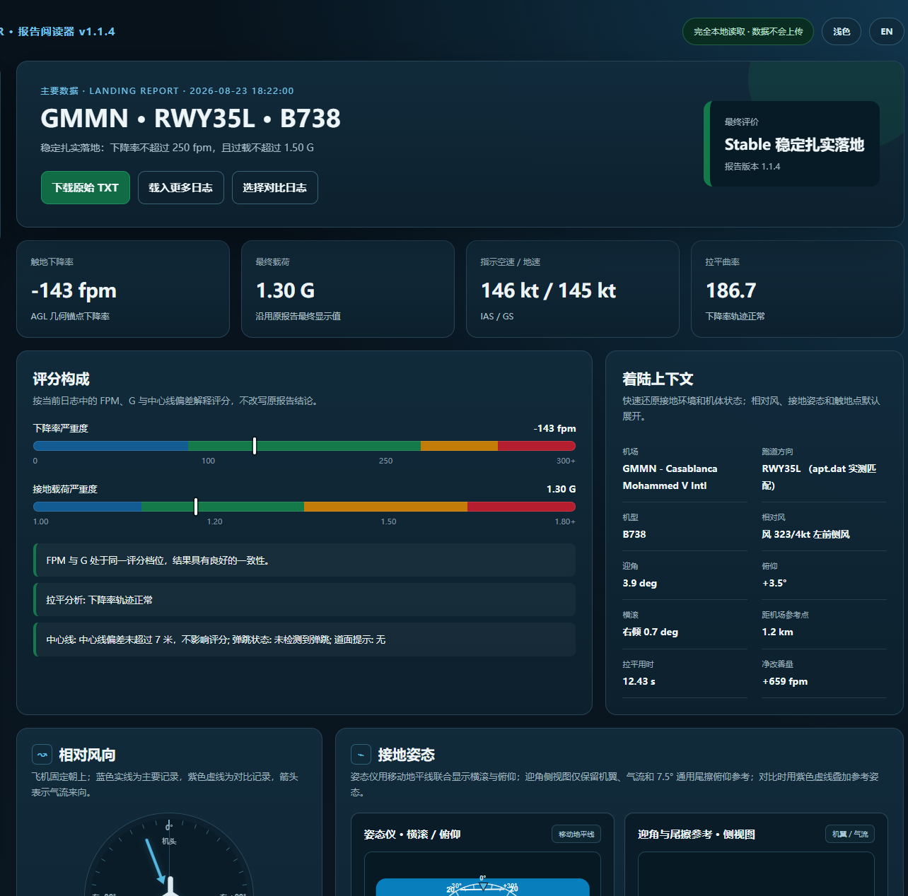
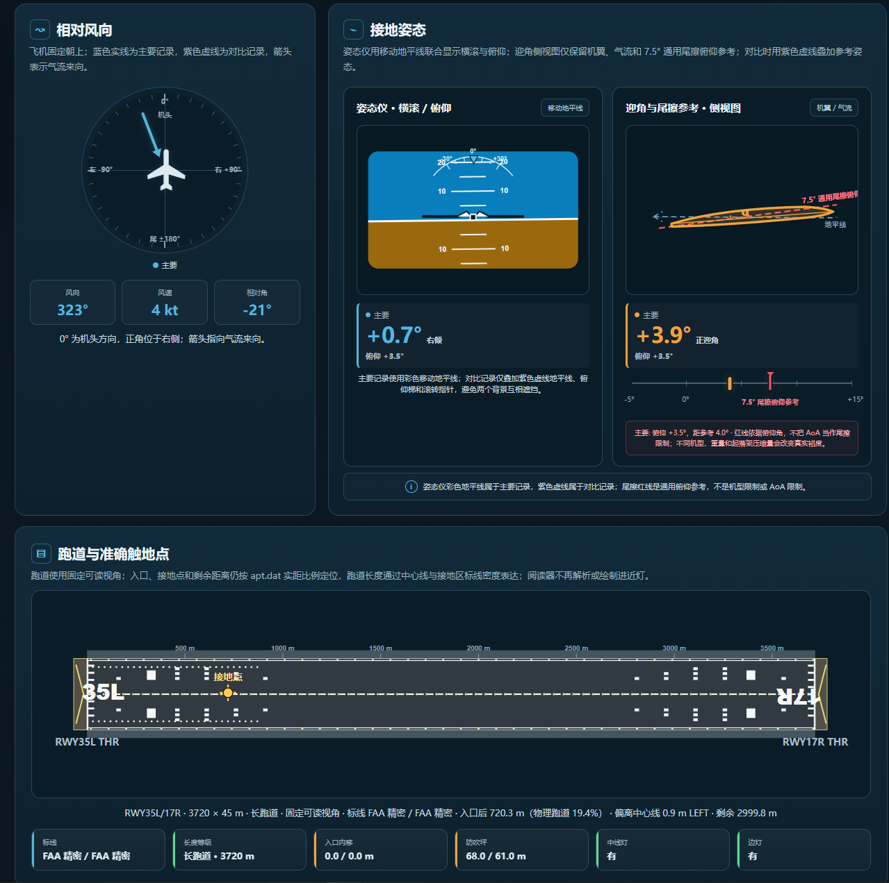
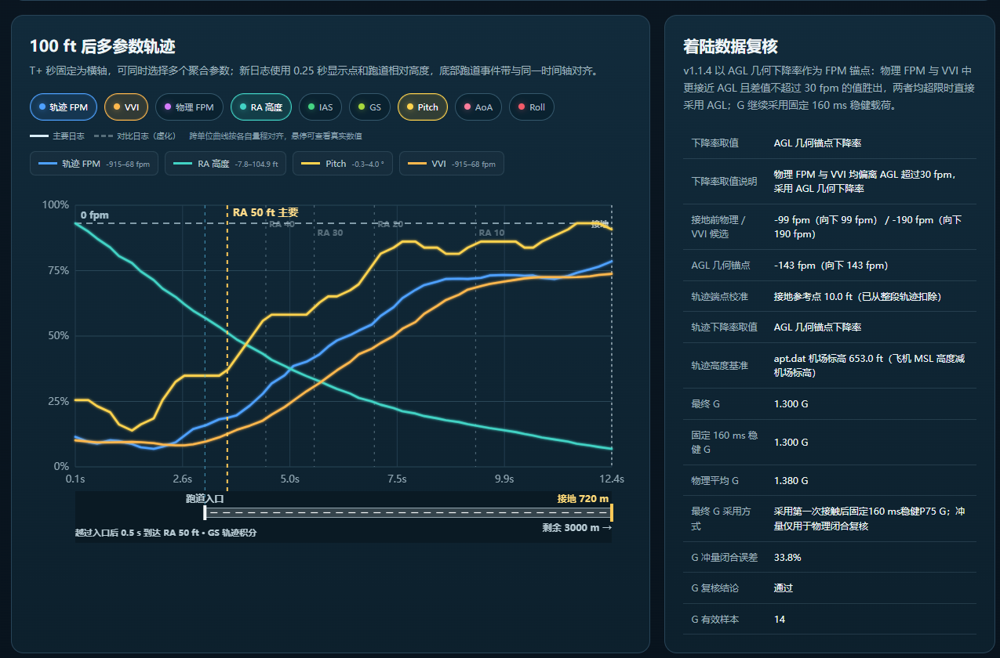

# StarLux Landing Meter

[](https://github.com/Starlux531/StarLux-Landing-Meter/releases)
[](LICENSE)
[](https://www.x-plane.com/)

StarLux Landing Meter 是一款适用于 X-Plane 12 与 FlyWithLua NG+ 的落地分析插件。它会采集触地阶段的垂直速度、载荷、姿态、速度、风况和拉平轨迹，在游戏内给出结果，并生成可复盘、可对比、可复算的本地 TXT 报告。

> **v1.1.4 稳定测试版**已归档为后续开发锚点：FPM 使用 AGL 几何锚点在物理测量与 VVI 间择近，G 使用固定 160 ms 稳健载荷；报告保留三条下降率与冲量闭合复核值。

## v1.1.4 稳定测试版功能

- FPM 以 5 ft 以下的 AGL Theil-Sen 几何下降率作为跨机模锚点；在物理 FPM 与 VVI 中选择距离 AGL 最近且差值不超过 30 fpm 的值，两者均超限时直接采用 AGL
- 物理候选优先使用接地前 100 ms 离地速度中位数，短窗缺样时使用 250 ms 物理 P25；AGL 缺样时才依次回退到物理候选和 VVI
- G 优先采用第一次接触后固定 160 ms 的 P75 稳健载荷；物理平均 G 与 `(G-1)g` 冲量闭合用于复核，缺样时才启用受 FPM 保护的备用值
- 使用固定环形缓冲区和分阶段计算，避免把机场查询、日志写入和复杂分析集中在触地关键帧
- 记录机型、落地机场、apt.dat 实测跑道与触地点、IAS、TAS、GS、迎角、横滚、磁航向和风况
- 在 140 ft 内提前以 10 Hz 预采样，触地后扣除飞机参考点接地高度并从校准后的 100 ft 重新裁切，以 0.25 秒聚合点显示；优先使用飞机 MSL 高度减 apt.dat 机场标高，避免海岸／悬崖地形 AGL 跳变及接地末点被强制截断
- 检测 Bounce Landing，并按既定规则降级非红色评价
- 低高度阶段监测降水与 X-Plane 跑道摩擦状态，保留明确的提示来源
- 提供 Nice、Stable、Attention、UNSTABLE 四级评价；UNSTABLE 对外表述为“不良落地”
- 独立设置窗口：数据输出语言、精准跑道识别、五种弹窗模式、30/60/120 秒时长、九宫格位置、横/竖布局、三档透明度和详细数学日志
- 提供“分析后立刻”“低于 30 kt”“停稳 10 秒”“不自动弹窗”四种显示时机
- 回放模式停止采样、触发和报告写入，退出回放后重置瞬时状态
- 自动生成跟随“Data output language”设置的 UTF-8 中文 / English TXT，文件名包含机场、机型、跑道与 `_CN` / `_EN` 标记
- 游戏内记录管理窗口可浏览、打开或删除最近日志
- 统一的本地网页阅读器：插件内打开和独立打开使用同一套界面
- 支持选择第二份日志进行对比，显示关键差值，叠加相对风、横滚／俯仰姿态仪、机翼／气流迎角侧视图及 100 ft 拉平轨迹
- 100 ft 图表可同时选择轨迹 FPM、VVI、物理 FPM、RA、IAS、GS、Pitch、AoA 与 Roll，使用独立颜色和动态图例
- 全程本地运行，不联网、不上传飞行数据

## 界面展示

以下图片来自 v1.1.4 稳定测试版的实际落地报告，展示新版阅读器总览、着陆上下文、真实跑道和 100 ft 多参数复盘体系。

### 报告总览与评分构成

<p align="center">
  
</p>

### 相对风、姿态仪、迎角与真实跑道

<p align="center">
  
</p>

### 100 ft 多参数轨迹与数据复核

<p align="center">
  
</p>

## 运行要求

- X-Plane 12
- 支持浮动窗口与 ImGui 的 FlyWithLua NG+
- 用于打开报告的现代浏览器

## 安装

从 [GitHub Releases v1.1.4](https://github.com/Starlux531/StarLux-Landing-Meter/releases/tag/v1.1.4) 下载稳定测试版压缩包。国内版默认中文，International 版默认英文；两者只在初始 `LMM_Settings.cfg` 中的语言设置不同。

将压缩包内容放入：

```text
X-Plane 12/Resources/plugins/FlyWithLua/Scripts/
```

必需文件：

```text
StarLux_LMM_v1.1.4.lua
LMM_Report_Reader.html
LMM_Settings.cfg
LMM_Log/
```

如果安装过旧版本，请把旧版 `StarLux_LMM_*.lua` 移出 `Scripts`，避免多个版本同时运行。随后启动 X-Plane，或通过 FlyWithLua 重新加载所有 Lua 脚本。

## 游戏内入口

设置窗口：

```text
Plugins > FlyWithLua > FlyWithLua Macros > StarLux LMM | 打开设置/Open Setting
```

落地记录：

```text
Plugins > FlyWithLua > FlyWithLua Macros > StarLux LMM | 落地记录/Landing Record
```

也可以绑定设置命令：

```text
starlux/lmm/open_settings
```

设置窗口和落地记录管理器固定使用英文 ImGui 标签；两个宏菜单入口使用中英文并列名称。

## 弹窗模式

| 模式 | 行为 |
|---|---|
| 分析完成后立刻 | 触地分析、评分和缓存完成后显示 |
| 地速低于 30 kt | 落地完成后等待滑跑速度降到阈值 |
| 停稳并持续 10 秒 | 地速不高于 1 kt 连续 10 秒后显示 |
| 不自动显示 | 仍生成报告，但不弹出落地数据窗 |

## 评分标准

| 评价 | 颜色 | 下降率 | 过载 |
|---|---|---:|---:|
| Nice 轻柔接地 | 深蓝色 | ≤ 100 fpm | ≤ 1.20 G |
| Stable 稳定扎实落地 | 深绿色 | ≤ 250 fpm | ≤ 1.50 G |
| Attention 需注意 | 深橙色 | ≤ 300 fpm | ≤ 1.80 G |
| UNSTABLE 不良落地 | 深红色 | > 300 fpm，或过载超限 | > 1.80 G，或下降率超限 |

FPM 与 G 分别分档并取两项中较严重的等级；精准跑道识别成功后再应用中心线修正：偏差超过 7 m 时在非红等级内降一级，超过 15 m 时直接为 UNSTABLE。各项不做平均或抵消。UNSTABLE 表示数据超出当前插件 Attention 上限，并不等同于航司维修检查或适航结论。

## 报告与数据对比

每次有效落地会在 `LMM_Log` 中生成一份 TXT。v1.1.4 的普通报告会直接写明 FPM 采用源与采用原因，并保留接地前物理候选、AGL 几何锚点、VVI 候选、固定 160 ms 稳健 G、物理平均 G、冲量闭合误差和样本质量；不再堆叠容易混淆的内部峰值、基线、置信度与分支中间量。

报告正文跟随设置窗口中的“Data output language”：Chinese 生成 `_CN.txt`，English 生成 `_EN.txt`。两种报告都可由同一份阅读器载入、对比和切换网页显示语言。

v1.1.4 继承 v1.1.3 的精准跑道识别：会在 5000–100 ft 下降进近阶段按帧预读附近机场的 apt.dat 数据，触地后用真实坐标和地速向量选择跑道方向，并输出跑道双端、标线、TDZ／REIL／中线灯／边灯属性、入口距离、剩余距离和带方向的中心线偏差。插件不再解析或写出进近灯字段，阅读器也不绘制进近灯。阅读器使用固定可读视角绘制完整跑道，物理起点、入口、接地点和剩余距离仍保持真实纵向比例；跑道长短由中心线、距离刻度与接地区标线密度表达。100 ft 轨迹图使用 GS 轨迹梯形积分反推跑道入口时间，让入口、RA 50 ft 与接地在同一时间轴上对应显示，GS 样本不足时回退到报告 GS 估算。插件不会用磁航向猜测真实跑道；无法完成几何匹配时会保留明确的失败原因。

阅读器的着陆上下文采用“读数优先、图形解释”的仪表化布局：相对风显示机头基准刻度、风向／风速／相对角摘要；姿态仪用移动地平线联合解释横滚与俯仰，迎角侧视图仅绘制机翼、弦线、气流和 7.5° 通用尾擦俯仰参考，下方刻度也会显示独立红色 7.5° 参考标记。页面、侧栏、卡片、绘图区和辅助文字统一采用更大的可读性尺度，深浅主题均保持高对比度。

- `物理 FPM（最接近 AGL）`
- `VVI（最接近 AGL）`
- `AGL 几何锚点下降率`
- `物理 FPM（AGL 缺样备用）`
- `VVI（AGL 与物理样本缺失备用）`

游戏内记录窗口点击某条记录时，Lua 会调用同目录下的 `LMM_Report_Reader.html`，自动载入所选日志。

也可以不启动 X-Plane，直接双击 `LMM_Report_Reader.html`：

1. 点击“选择落地日志”，或拖入一份/多份 `LMM_*.txt`。
2. 点击左侧记录主体切换主要数据。
3. 点击记录右侧“对比”，或使用“选择对比日志”载入第二份数据。
4. 在 100 ft 图表上选择一个或多个数据源：轨迹 FPM、VVI、物理 FPM、RA、IAS、GS、Pitch、AoA 或 Roll。
5. 相对风、接地姿态和触地点默认展示；迎角卡片的图形区与下方刻度都会标出 7.5° 通用尾擦俯仰参考；右上角可切换深色／浅色主题。
6. 每个数据源使用固定颜色；主要日志为清晰实线，对比日志为同色半透明虚线。
7. 相同单位共享量程，不同单位自动缩放；鼠标悬停可查看两份日志的真实数值。
8. “交换主／对比”可改变两份数据的角色；“取消对比”不会删除日志。对比开启时，相对风、姿态仪地平线／滚转指针和迎角侧视图的机翼／气流也会同步叠加两份记录。

对比只用于复盘，不会改变日志原有评分。阅读器兼容旧版 `0.5秒聚合轨迹表` 和新版 `0.25秒聚合轨迹表`；只要日志包含聚合轨迹表即可绘制 100 ft 多参数轨迹。对于旧日志中“最后一个真实高度仍大于 5 ft、随后接地点被强制写为 0 ft”的特征，阅读器会用末段物理垂直速度反推接地参考高度，仅校准高度曲线，不改动 FPM、姿态或评分。

## 文件与隐私

- TXT 报告、网页桥接数据和设置文件均只写入本机。
- `LMM_Viewer.html` 与 `LMM_Viewer_Data.js` 是插件打开报告时在 `LMM_Log` 中生成的本地临时阅读文件。
- 正式发布包不包含作者或测试人员的个人飞行日志。
- 刷新或关闭独立阅读器后，浏览器内已载入的数据会自动清空。
- X-Plane 回放不会生成新的落地报告。

## 文档

- [中文使用说明](README_使用说明.txt)
- [QA 常见问题](QA常见问题.md)
- [更新记录](CHANGELOG.md)
- [v1.1.4 稳定测试版发布说明](RELEASE_NOTES_v1.1.4.md)
- [产品路线图](ROADMAP.md)
- [v1.1.4 稳定测试版项目总结](docs/StarLux_LMM_v1.1.4_稳定测试版项目总结报告.md)
- [v1.1 正式版说明（历史发布）](RELEASE_NOTES_v1.1.md)
- [1.0 正式版说明（历史发布）](RELEASE_NOTES_v1.0.md)
- 核心算法技术说明手册正在二次校订，将在后续单独更新。

## 故障排查

如果脚本被 FlyWithLua 隔离，或设置、日志、阅读器无法生成，请检查：

- `StarLux_LMM_v1.1.4.lua` 与 `LMM_Report_Reader.html` 是否位于同一个 `Scripts` 目录
- X-Plane 安装目录是否具有写入权限
- `X-Plane 12/Log.txt` 中以 `[StarLux LMM]` 开头的信息

## 发现疑似异常时，请尽量提供这些信息

为了让问题可以复现和定位，请不要只提供最终的 FPM/G 截图。建议同时附上：

- X-Plane、FlyWithLua 与 LMM 的版本；
- 机型、具体机模名称和机模版本；
- 是正常飞行还是回放模式，是否使用暂停或时间倍率；
- 触地前后的大致帧率；
- 对应的 TXT 报告，最好开启“完整数学记录”；
- 机场、跑道、天气和道面情况；
- 是否同时运行其他落地率、相机、回放或飞行模型相关插件；
- 你认为异常的具体字段，以及预期它应该是多少；
- 视频或截图可作为辅助，但不能替代原始报告。

对于同一机模的系统性偏差，三至五份不同落地条件下的完整报告，通常比单次案例更有判断价值

## 许可证

本项目采用 [MIT License](LICENSE) 开源。

X-Plane、FlyWithLua 及相关名称归各自权利人所有。本项目与其官方开发者无隶属关系。
