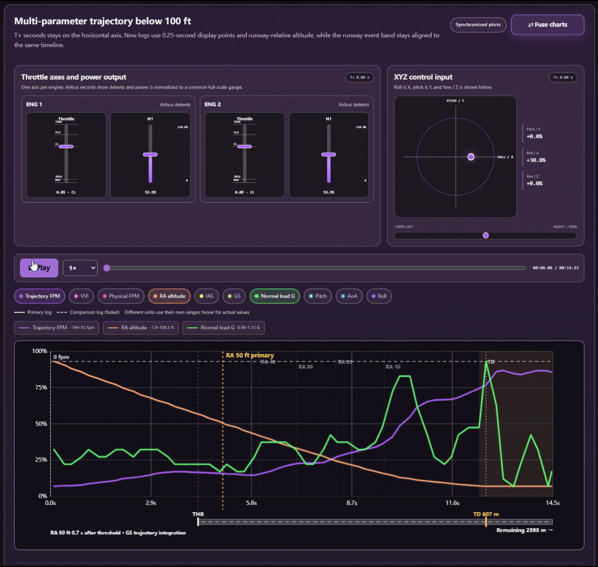
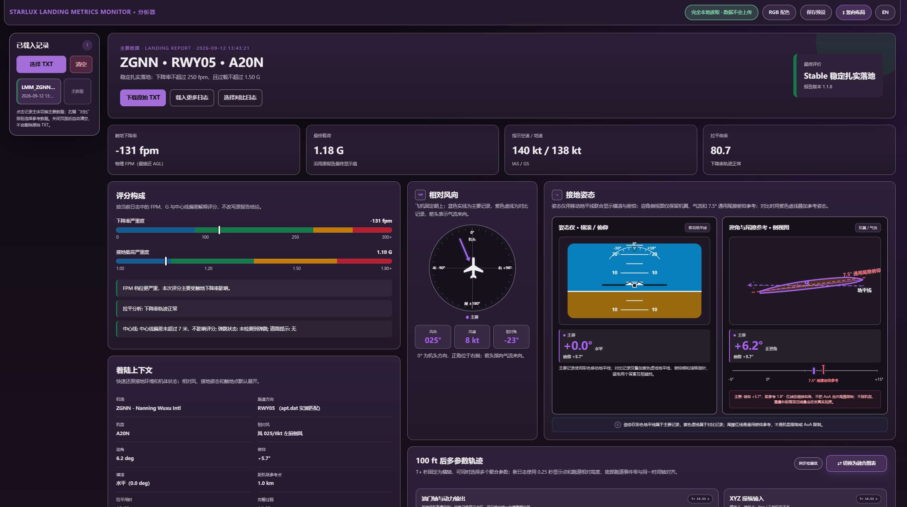
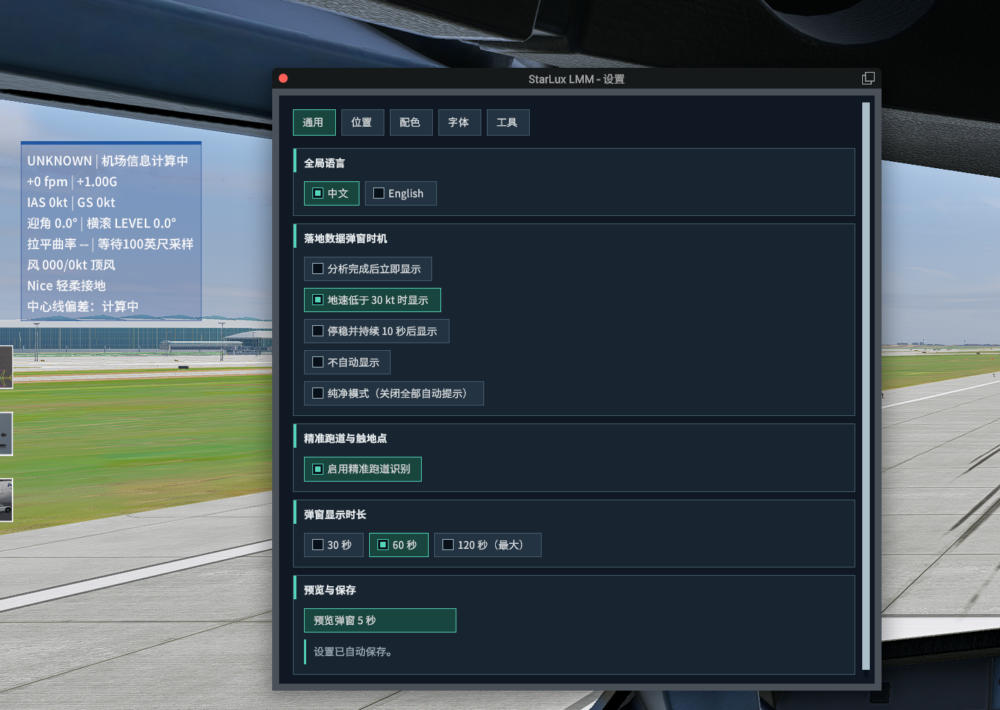
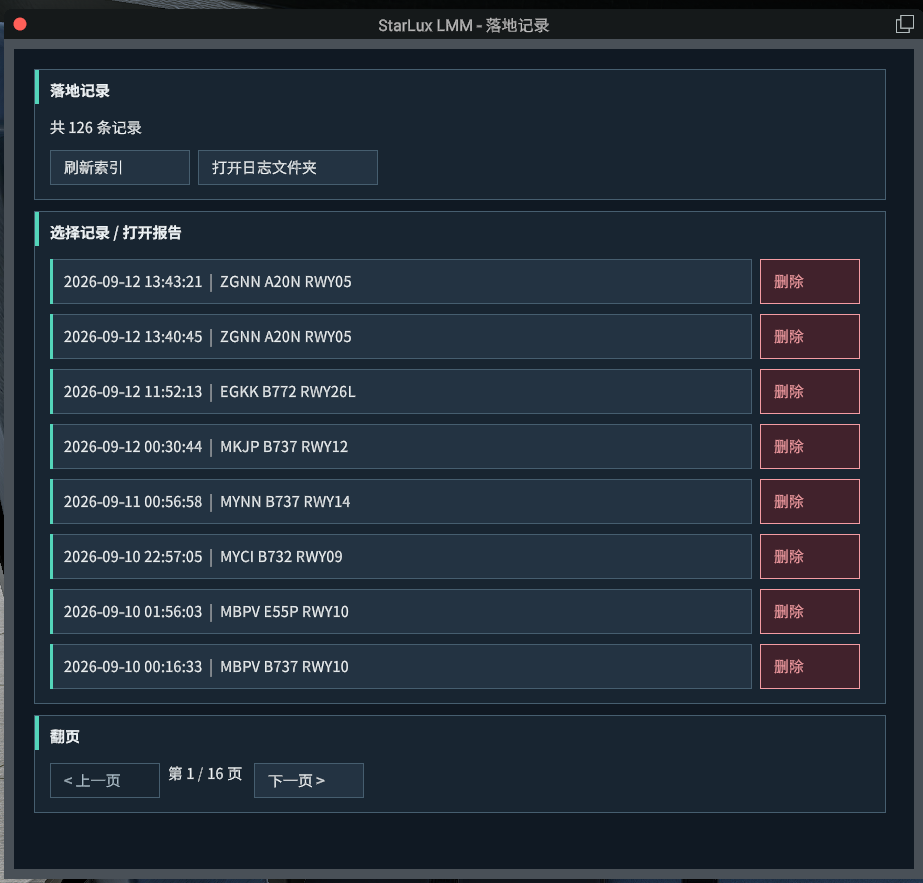
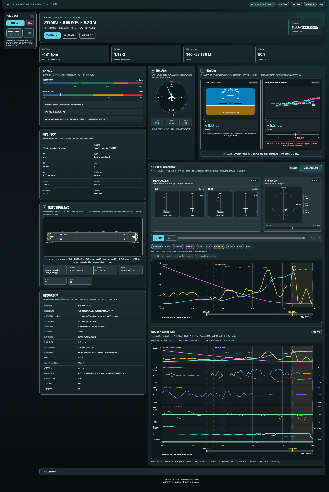
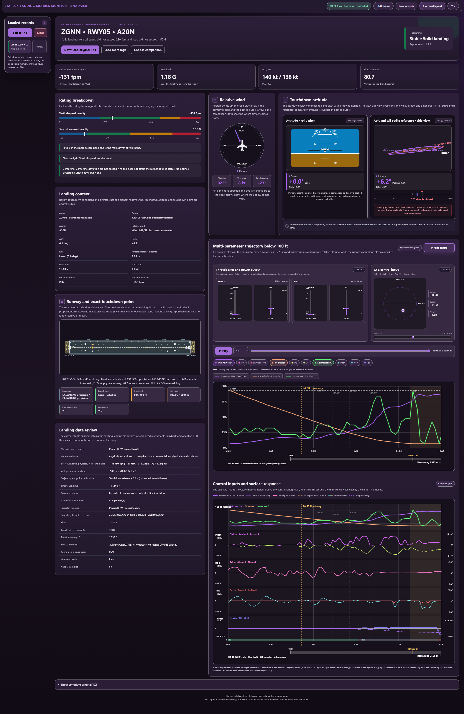
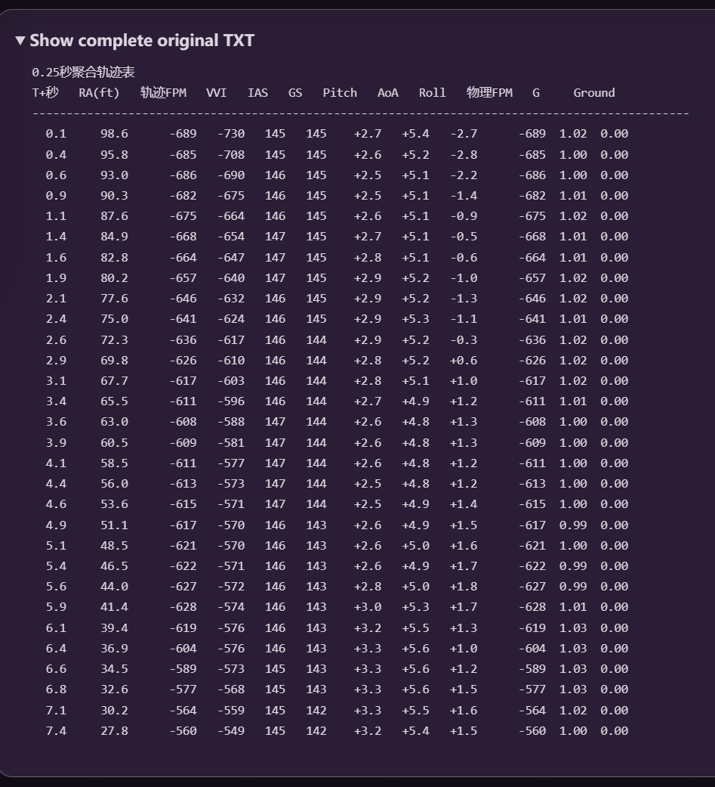
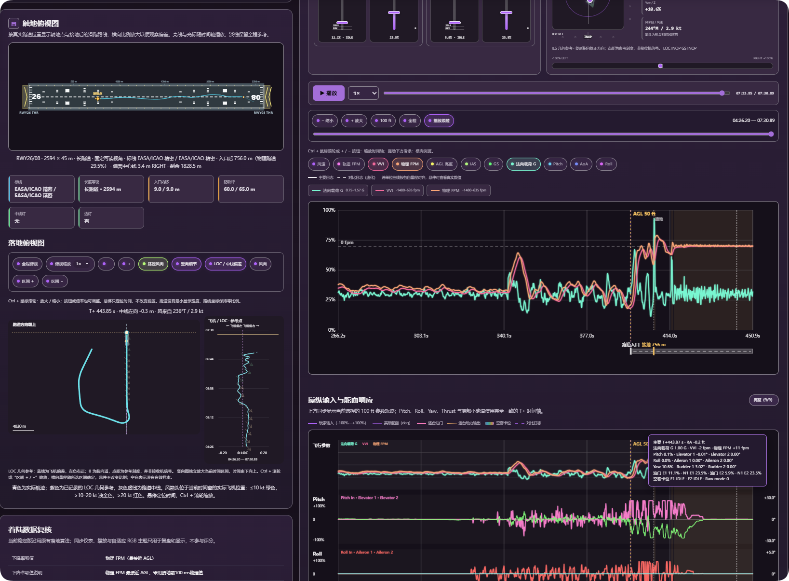
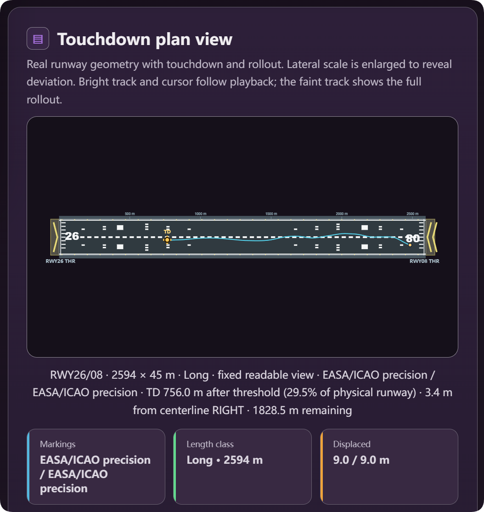

# StarLux Landing Meter · 1.1.9 正式版 / Stable

**1.1.9 于 2026-09-23 正式发布。** 从 2500 ft 地形 AGL 进近至低速滑跑的连续录制、逐时刻风与操纵数据、完整时间轴复盘、滑跑中心线评分和独立游戏覆盖层现已整合。

**[下载 / Download 1.1.9](https://github.com/Starlux531/StarLux-Landing-Meter/releases/tag/v1.1.9)** · [版本说明](README_1.1.9.md) · [发行说明 / Release notes](RELEASE_NOTES_v1.1.9.md) · [更新记录](CHANGELOG.md) · [路线图](ROADMAP.md)

- 国内用户：`StarLux_LMM_Installer_1.1.9_CN.zip`；海外用户：`StarLux_LMM_Installer_1.1.9_EN.zip`（归档内全部为英文文件名）。完整包内置安装器 1.0.1 和四种插件载荷，已有安装器也可联网选择 1.1.9。
- **Standard：Windows x64、XP 12.4.4+、FlyWithLua NG+。Compatibility：旧 XP 12，采用传统控件和数字覆盖层。** CN / International 只决定首次安装的默认语言，已有设置优先。安装器仅适用于 Windows。
- 安装器保留已有设置、飞行记录和机场缓存，备份并替换插件文件。只安装包内的当前主脚本、完整 UI 目录和报告分析器，不要把不同版本主脚本同时放入 Scripts。
- 覆盖层支持拖动、边缘缩放、折叠、实时风及 N1 反推；AP / AT 监测提示已移除，ILS 参考仅用于分析器。
- 大盘分析仍为独立验证模块，游戏内实时 G 曲线及 FF777 专有输入适配留待后续开发。正式发布不代表所有机模与平台均已完成实测。

Version 1.1.9 is stable. Choose the EN offline bundle for ASCII filenames, or use the existing installer to discover the four edition/language packages. Standard requires Windows x64, XP 12.4.4+ and FlyWithLua NG+; Compatibility retains legacy controls and numeric overlays on older XP 12. Existing settings and flight records are preserved. See the bilingual release notes for features and limitations.

| 文件或目录 | 用途 |
| --- | --- |
| `StarLux_LMM_v1.1.9.lua`、`LMM_UI_119/` | 当前主脚本、运行模块与字体 |
| `LMM_Report_Reader.html` | 插件报告分析器 |
| `Starlux_Analyzer_落地分析器.html` | 独立网页分析器 |
| `development.json` | 当前版本和稳定 / 开发通道 |
| `tools/`、`tests/`、`installer/` | 构建与验证工具、安装器源码 |

以下图集继承自 1.1.8，不代表 1.1.9 覆盖层截图。

## 动态演示 / Interactive charts in motion

100 ft 轨迹、操纵输入、舵面响应和动力输出共用时间轴，鼠标指向可同步读数；支持播放、拖动进度与融合／分离视图。

Trajectory, controls, surfaces and power output share one timeline, with synchronized hover readouts, playback, scrubbing and fused/separated views.

  

作者提供的原始 GIF，约 10 MB。点击查看原图。 / Original author-provided GIF, about 10 MB; click to view.

## 报告总览 / Landing report overview

接地读数、评分来源、相对风、姿态、真实跑道位置与操作曲线集中复盘。网页颜色由 RGB 自动生成，也可保存缩放、布局与曲线选择。

Review touchdown values, rating sources, wind, attitude, runway geometry and control traces together. RGB themes and saved presets include zoom, layout and selected curves.

  

## 游戏内设置与记录 / In-simulator settings and records

两个独立菜单入口；设置按通用、位置、配色、字体、工具分区，记录窗口区分打开、删除确认与翻页。下面是标准版的作者实机截图，设置图左侧为预览弹窗，不是一次有效落地结果。

Separate Settings and Landing records menus, grouped settings, visible slider handles and confirmed deletion. These are author-provided standard-edition screenshots; the popup in the Settings screenshot is a preview, not a recorded landing.

<table>
  <tr><th width="55%">设置与弹窗预览 / Settings &amp; popup preview</th><th width="45%">落地记录 / Landing records</th></tr>
  <tr>
    <td valign="top"></td>
    <td valign="top"></td>
  </tr>
</table>

## 完整图集：配色、英文界面和原始数据 / Full gallery: themes, English UI and raw data

### 完整复盘页面 / Complete dashboards

长截图并排展示不同配色和语言，点击可查看原分辨率。英文界面可加载中文历史报告，原始 TXT 保持原文。

Click either full-page screenshot for original resolution. English UI can load historical Chinese reports; the raw TXT remains unchanged.

<table>
  <tr><th width="50%">青色主题 / Cyan theme</th><th width="50%">英文紫色主题 / English violet theme</th></tr>
  <tr>
    <td valign="top"></td>
    <td valign="top"></td>
  </tr>
</table>

### 可核对的原始记录 / Inspectable source records

保留 TXT 聚合轨迹表，方便核对每个时间点的数据，不改写原始记录。

The original aggregated TXT trace remains available for checking recorded samples.

  

## 当前能力 / Features

- **接地过程**：完整记录跟随接地与滑跑直至地速低于 30 kt 连续两秒；弹跳监测不再受 6 秒／100 ft 短窗限制。FPM 保留物理、VVI、AGL 的来源复核，G 保留固定 160 ms 稳健值与冲量闭合复核。
- **操纵与动力**：三轴输入、实际舵面、逐发动机油门和 N1 等输出；按可用机模数据源适配，区分空客卡位与普通油门。缺失数据不假装已测得。
- **机场索引**：持久缓存、增量更新、按帧预算处理和进度提示；利用真实 apt.dat 几何匹配跑道与触地点。匹配失败保留状态，不猜测结果。
- **插件 UI**：标准版中英文、原生中文字号与字重、自定义评级颜色、九宫格及四向微调；报告生成提示融入落地弹窗。
- **分析器**：主／对比记录、同步仪表、最低 0.25× 播放、进度拖动、融合／分离图、横向布局、独立缩放与自适应 RGB 配色。
- **作者预设**：默认、黑暗玫瑰、巨峰葡萄、未来展厅、水晶紫罗兰。首次使用时提供，不覆盖已有保存列表；英文界面保留预设原名。

Complete touchdown/bounce capture; traceable FPM/G sources; control and engine traces; persistent incremental airport indexing; bilingual native UI; synchronized comparison and playback; configurable RGB themes and five author-approved presets. Data availability depends on aircraft and simulator interfaces.

## 评分与边界 / Rating and limitations

| 评价 / Rating | 下降率绝对值 / Descent-rate magnitude | 载荷 / Load |
| --- | ---: | ---: |
| Nice 轻柔接地 | ≤ 100 fpm | ≤ 1.20 G |
| Stable 稳定扎实落地 | ≤ 250 fpm | ≤ 1.50 G |
| Attention 需注意 | ≤ 300 fpm | ≤ 1.80 G |
| UNSTABLE 不良落地 | 超过上述上限 / Above the limits | 超过上述上限 / Above the limits |

FPM 与 G 取较严重等级，不互相抵消。成功匹配跑道后应用中心线修正：超过 7 m 在非红等级内降一级，超过 15 m 进入 UNSTABLE；弹跳沿用既定修正规则。操纵曲线与拉平曲率仅用于复盘，不参与评分。图中 7.5° 尾擦线是通用俯仰参考，不是具体机型限制。

FPM and G use the more severe band, followed by existing centerline/bounce adjustments. Control traces and flare curvature are review-only. The 7.5° tail-strike line is a generic pitch reference, not an aircraft-specific limit. **For flight simulation only—not maintenance, airworthiness or operational guidance.**

## 数据、更新与隐私 / Data and privacy

报告、设置和机场缓存留在本机；插件和分析器不上传飞行数据。安装器才联网查询官方 GitHub／Gitee Releases、下载发行包。下载包不含作者的飞行 TXT、浏览器日志或个人配置；作者明确授权展示的截图与配色预设除外。

Reports/settings/cache stay local. Only the installer contacts official release sources. Packages exclude personal flight TXT files and browser data; screenshots and sanitized appearance presets are explicitly author-approved. The installer is not yet code-signed; see the [installation guide](README_1.1.9.md) for safeguards and limitations.

## 文档与反馈 / Documentation and feedback

- [1.1.9 开发与兼容说明 / Installation and compatibility](README_1.1.9.md)
- [安装器开发与构建 / Installer development](installer/README.md)
- [更新记录 / Changelog](CHANGELOG.md)
- [1.1.4 历史发布说明 / Archived release notes](旧版备份/2026-09-13_1.1.9开发前整理/v1.1.8-baseline/RELEASE_NOTES_v1.1.4.md)
- [1.1.4 核心版本总结 / Historical technical summary](旧版备份/2026-09-13_1.1.9开发前整理/v1.1.8-baseline/docs/StarLux_LMM_v1.1.4_稳定测试版项目总结报告.md)
- [贡献指南 / Contributing](CONTRIBUTING.md)

报告问题时请附 XP、FlyWithLua、LMM、机模版本，是否回放／暂停，触地前后帧率，以及对应 TXT（分享前检查个人信息）。脚本被隔离时同时提供 `[StarLux LMM]` 日志。三至五份不同落地条件的报告有助于定位系统性偏差，单张 FPM/G 截图不能替代原始记录。

For bug reports, include versions, aircraft, replay/pause status, frame rate and the corresponding TXT after checking it for personal information. Include LMM log lines if the script is quarantined. Multiple varied landings help diagnose systematic differences.

## 许可证 / License

代码采用 [MIT License](LICENSE)，随包 LMM UI 字体采用 [SIL OFL 1.1](LMM_UI_119/fonts/OFL.txt)。X-Plane、FlyWithLua 等名称归其权利人所有，本项目与其官方开发者无隶属关系。

Code: MIT. Bundled fonts: SIL OFL 1.1. This project is not affiliated with the X-Plane or FlyWithLua developers.

## 完整进近与滑跑复盘 / Full approach and rollout analysis

## 触地俯视图 / Touchdown plan view

